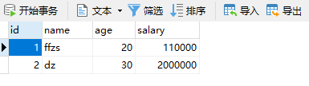
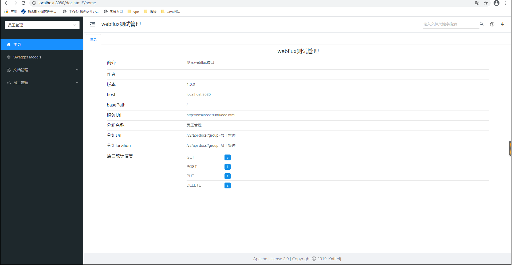
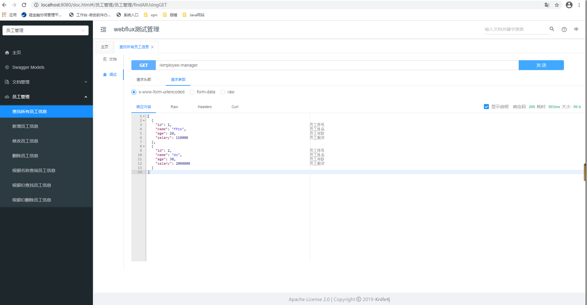
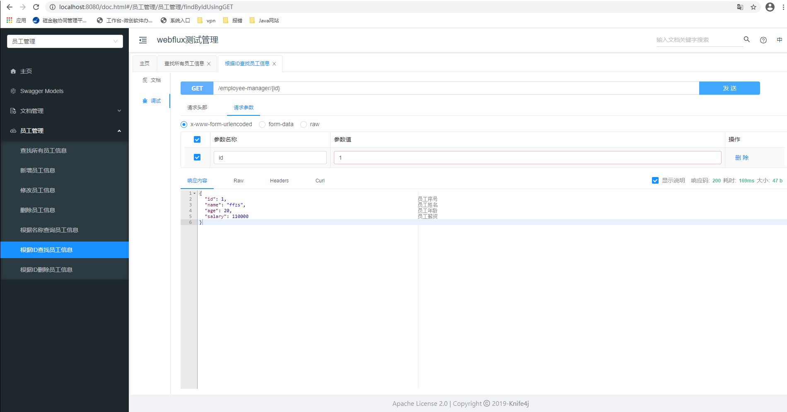
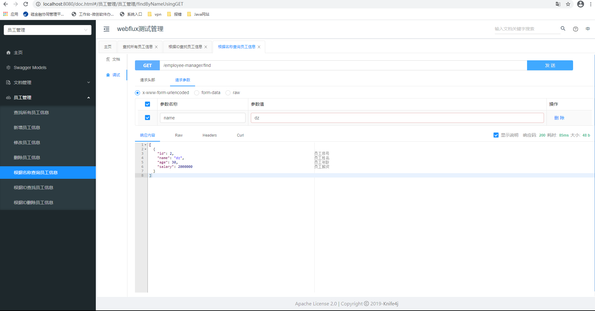

# Spring WebFlux:   r2dbc+mysql+swagger(knife4j) 创建 RESTFUL API

随着响应式编程在网络编程中使用越发的普及，mysql等一系列的关系型数据库也在r2dbc等包的帮助下支持响应式。虽然响应式跟原来的sevlet的写法区别比较大，但是spring尽量保持原来的风格，编写control层和service层的方法跟原来基本相同，略有区别就是controller返回的Mono或是Flux。特别是对crud的支持，跟原来的jpa基本相同。

## 例子：

### 1、创建table

在mysql数据库中创建一个命名为mydb的数据库，然后创建一个命名为employee的表用于测试， 字段内容如下：

+ id
+ name： 员工姓名
+ age：员工年龄
+ salary：员工薪酬

```sql
CREATE
DATABASE IF NOT EXISTS mydb;
USE
mydb;

DROP TABLE IF EXISTS `employee`;
CREATE TABLE `employee`
(
    `id`     bigint(20) NOT NULL AUTO_INCREMENT,
    `name`   varchar(100) NOT NULL,
    `age`    int(11) NOT NULL,
    `salary` bigint(20) NOT NULL,
    PRIMARY KEY (`id`),
    UNIQUE KEY `name` (`name`)
) ENGINE=InnoDB DEFAULT CHARSET=utf8;

BEGIN;
INSERT INTO `employee`
VALUES ('1', 'ffzs', '20', '110000'),
       ('2', 'dz', '30', '2000000');
COMMIT;
```



### 2、创建spring项目

使用gradle维护项目，使用的支持:

```java
dependencies{
        implementation'org.springframework.boot:spring-boot-starter-data-r2dbc'
        implementation'org.springframework.boot:spring-boot-starter-webflux'
        compile group:'com.github.xiaoymin',name:'knife4j-spring-boot-starter',version:'2.0.2'
        compile group:'io.springfox',name:'springfox-boot-starter',version:'3.0.0'
        compileOnly group:'javax.servlet',name:'javax.servlet-api',version:'3.0.1'
        compile group:'org.springframework.boot',name:'spring-boot-autoconfigure-processor',version:'2.4.1'
        annotationProcessor"org.springframework.boot:spring-boot-configuration-processor:2.4.1"
        compileOnly'org.projectlombok:lombok'
        runtimeOnly'dev.miku:r2dbc-mysql'
        runtimeOnly'mysql:mysql-connector-java'
        annotationProcessor'org.projectlombok:lombok'
        testImplementation('org.springframework.boot:spring-boot-starter-test'){
        exclude group:'org.junit.vintage',module:'junit-vintage-engine'
        }
        testImplementation'io.projectreactor:reactor-test'

        }
```

### 3、编写配置文件

主要配置mysql的链接，r2dbc链接的url跟jdbc的略有不同，需要注意

application.yml

```yml
spring:
  #mysql数据库配置
  r2dbc:
    url: r2dbcs:mysql://localhost:3306/mydb?useUnicode=true&zeroDateTimeBehavior=convertToNull&autoReconnect=true&characterEncoding=utf-8
    username: root
    password: admin
  #swagger配置
  swagger:
    group-name: 员工管理
    title: webflux测试管理
    description: 测试webflux接口
    version: 1.0.0
    terms-of-service-url:
    base-package: com.ffzs.webflux.r2dbc_test.controller
```

### 4、编写model类

Employee.class

```java
import io.swagger.annotations.ApiModel;
import io.swagger.annotations.ApiModelProperty;
import lombok.*;
import org.springframework.data.annotation.Id;
import org.springframework.data.relational.core.mapping.Table;

@Data
@AllArgsConstructor
@NoArgsConstructor
@Builder
@With
@Table("employee")
@ApiModel(value = "员工类")
public class Employee {
    @Id
    @ApiModelProperty(value = "员工序号", position = 1)
    private long id;
    @ApiModelProperty(value = "员工姓名", position = 2)
    private String name;
    @ApiModelProperty(value = "员工年龄", position = 3)
    private long age;
    @ApiModelProperty(value = "员工薪资", position = 4)
    private long salary;
}
```

### 5、 dao层编写

跟jpa使用基本相同，不过这里继承的事响应式的crud类`ReactiveCrudRepository`

```java
public interface EmployeeDao extends ReactiveCrudRepository<Employee, Long> {
    /**
     * 根据用户名查询用户信息
     *
     * @param name -用户名称
     * @return
     */
    Flux<Employee> findByName(String name);
```

### 6、service层编写

+ 编写了常见的增删改查的功能
+ 跟之前的不同之处是这里返回的值为Reactor的对象Flux或Mono

```java

@Service
@RequiredArgsConstructor
public class EmployeeService {

    private final EmployeeDao employeeDao;

    /**
     * 查询所有员工信息
     *
     * @return 所有用户信息
     */
    public Flux<Employee> findAll() {
        return employeeDao.findAll();
    }

    /**
     * 根据id查询员工信息
     *
     * @param id -员工id
     * @return
     */
    public Mono<Employee> findById(long id) {
        return employeeDao.findById(id);
    }

    /**
     * 根据name查询员工信息
     *
     * @param name -员工名称
     * @return
     */
    public Flux<Employee> findByName(String name) {
        return employeeDao.findByName(name);
    }

    /**
     * 保存员工信息
     *
     * @param employee -要保存的员工信息参数
     * @return
     */
    public Mono<Employee> save(Employee employee) {
        return employeeDao.save(employee);
    }

    /**
     * 修改员工信息
     *
     * @param employee
     * @return
     */
    public Mono<Void> update(Employee employee) {
        return findById(employee.getId())
                .map(em -> employee.withId(em.getId()))
                .flatMap(employeeDao::save)
                .then();
    }

    /**
     * 删除员工信息
     *
     * @param employee
     * @return
     */
    public Mono<Void> delete(Employee employee) {
        return employeeDao.delete(employee);
    }

    /**
     * 根据员工ID信息进行删除
     *
     * @param id -员工ID
     * @return
     */
    public Mono<Void> deleteById(long id) {
        return employeeDao.deleteById(id);
    }
}

```

### 7、controller层编写

+ 应用RESTful api 特点，一个路由可以有get，post，put，delete四种功能
+ 跟service层对应实现增删改查的功能

```java

@RestController
@RequiredArgsConstructor
@RequestMapping("/employee-manager")
@Slf4j
@Api(tags = "员工管理")
@RestControllerAdvice
public class EmployeeController {

    private final EmployeeService employeeService;

    @GetMapping
    @ApiOperation(value = "查找所有员工信息")
    public Flux<Employee> findAll() {
        return employeeService.findAll();
    }

    @GetMapping(path = "/{id}")
    @ApiOperation(value = "根据ID查找员工信息")
    public Mono<Employee> findById(@PathVariable long id) {
        return employeeService.findById(id);
    }

    @GetMapping("find")
    @ApiOperation(value = "根据名称查询员工信息")
    public Flux<Employee> findByName(@RequestParam("name") String name) {
        return employeeService.findByName(name);
    }

    @PostMapping
    @ApiOperation(value = "新增员工信息")
    @ResponseStatus(HttpStatus.CREATED)
    public Mono<Employee> save(@RequestBody Employee employee) {
        return employeeService.save(employee);
    }

    @PutMapping
    @ApiOperation(value = "修改员工信息")
    @ResponseStatus(HttpStatus.NO_CONTENT)
    public Mono<Void> update(@RequestBody Employee employee) {
        return employeeService.update(employee);
    }

    @DeleteMapping
    @ApiOperation(value = "删除员工信息")
    @ResponseStatus(HttpStatus.NO_CONTENT)
    public Mono<Void> delete(@RequestBody Employee employee) {
        return employeeService.delete(employee);
    }

    @DeleteMapping(path = "{id}")
    @ApiOperation(value = "根据ID删除员工信息")
    @ResponseStatus(HttpStatus.NO_CONTENT)
    public Mono<Void> deleteById(@PathVariable long id) {
        return employeeService.deleteById(id);
    }
}

```

### 8、测试

项目集成knife4j的swagger进行api接口测试，添加依赖：

```java
compile group:'com.github.xiaoymin',name:'knife4j-spring-boot-starter',version:'2.0.2'
```

访问swagger测试页面 `http://localhost:8080/doc.html`，就会完成跳转到测试页面：



#### 测试findAll



#### 测试findById



#### 测试findByName

## 代码

github
[项目地址](https://github.com/willsmithchen/WebFlux-R2DBC)